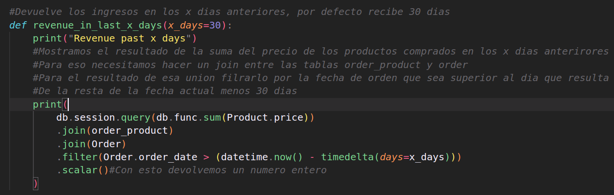

# Paso #1:

# Creación del entorno virtual.

---

Primero que todo debemos comprobar si tenemos instalada la herramienta venv de Python.

Una vez instalada ejecutamos los siguientes pasos:

1. Abrimos una terminal en la ruta donde deseamos crear nuestro proyecto.
2. Creamos una carpeta con el comando: `mkdir nombre_de_la_carpeta`.
3. Entramos dentro de ella: `cd nombre_de_la_carpeta`.
4. Como me encuentro en un sistema Linux ejecuto el comando: `python3 -m venv env`, pero si nos encontramos en Windows ejecutamos el comando `py -3 -m venv env`.
5. Una vez creado el entorno procedemos a su activación para poder instalar las herramientas necesarias para realización del mismo. Para ello ejecutamos el comando `source env/bin/activate ` o en Windows `env\Scripts\activate`.

En la siguiente captura ya he instalado los recursos necesarios para llevar a cabo este tutorial:

 

# Paso #2:

# Creamos un archivo Python y procedemos a configurar nuestra base de datos.

---


Como podemos observar:

1. Primero importamos lo que vamos a necesitar.
2. Creamos una instancia que por convenio se llama app.
3. Haciendo uso del método `config` configuramos nuestra base de datos.
4. Por último, establecemos una relación entre nuestra app de Flask y nuestra base de datos.

---

# Paso #3:

# Creamos nuestras tablas (Models).


Como podemos observar:

1. Creamos las columnas de nuestras tablas y establecemos el tipo de datos de cada una de ellas.
2. Establecemos como primary_key la columna id en las 3 tablas.
3. En caso de la tabla Order, la columna order_date recibirá por defecto la hora en ese momento.
4. Las columnas que no pueden recibir un valor nulo, contienen dentro de su declaración la palabra reservada `nullable` con valor `False`.
5. Las columnas, que son únicas, contienen dentro de su declaración la palabra reservada `unique` con valor `True`.

# Paso #4

# Establecemos la relación entre nuestras tablas.


# Quedando nuestro código de la siguiente manera.


# Paso #5

# Creación del archivo que contiene nuestra base de datos. Comprobamos su correcto funcionamiento.


Pasos:

1. Accedemos a la consola Flask haciendo uso del comando `flask shell`.
2. Importamos de nuestra aplicación flask "app" db para poder generar nuestra base de datos.
3. Generamos nuestra base de datos haciendo uso del comando `db.create_all()`.

### Procedemos a comprobar su correcto funcionamiento.


Pasos:

1. Debemos verificar que tenemos instalada la herramienta sqlite3.
2. Ejecutamos el comando `sqlite3 nombre_del_archivo_db`.
3. Verificamos las tablas creadas con el comando `.tables`.
4. Verificamos el esquema de cada una de nuestras tablas con el comando `.schema`.

De esa forma comprobamos que todo está en orden y podemos continuar.

# Paso #6

# Agregar información a nuestra base de datos.


Pasos:

1. Accedemos a nuestra consola Flask con el comando `flask shell`.
2. Importamos de nuestra app flask "app": db, Product, Order, Customer.
3. Para crear un registro primero creamos una variable y creamos una instancia de la clase (model), en este caso queremos agregar un cliente llamado jhondoe.
4. Añadimos a nuestra base de datos al cliente haciendo uso del comando `db.session.add(nombre_de_la_variable)`.
5. Por último, guardamos los cambios con el comando `db.session.commit()`.

### Procedemos a comprobar que hemos agregado correctamente a nuestro cliente.


Pasos:

1. Ejecutamos el comando `sqlite3 nombre_del_archivo_db`.
2. Realizamos una query `select * from customer;`.
3. Observamos que nuestro usuario ha sido agregado correctamente.

### Añadimos más datos a nuestra base de datos.


### Comprobamos que han sido agregados forma correcta.


# Paso #7

# Actualizar nuestra base de datos.


Pasos:

1. Accedemos a nuestra consola Flask.
2. Importamos de nuestra app flask "app": db, Customer.
3. Realizamos una query utilizando un filtro `filter_by()` y decimos por convenio que queremos solo el primer registro utilizando `first()`.
4. Comprobamos que es el registro que deseamos actualizar.
5. En este caso deseo actualizar la dirección `jhondoe.address = "..."`.
6. Una vez actualizado el valor, guardamos los cambios `db.session.commit()`.

# Paso #8

# Borrar datos.


Pasos:

1. Creamos un nuevo registro, para luego eliminarlo.
2. Comprobamos que ha sido agregado correctamente.
3. Hacemos una query para poder encontrar el registro que deseamos y lo asignamos una variable.
4. Comprobamos que es el registro que deseamos eliminar.
5. Eliminamos el registro haciendo uso del comando `db.session.delete(nombre_de_la_variable)`.
6. Guardamos los cambios con `db.session.commit()`.
7. Comprobamos que ha sido eliminado correctamente.

# Paso #9

# Generar información para nuestra base de datos.

Para ello utilizamos la librería Faker para generar datos falsos.
Ya la hemos instalado desde el inicio del tutorial cuando creamos el entorno de trabajo.

### Creamos un método para generar 100 clientes falsos.


### Creamos un método para generar 1000 pedidos.


### Creamos un método para agregar 10 productos.


### Establecemos la relación entre Order y Product.


### Creamos un método para llamar a las funciones anteriormente creadas y generar la información para nuestra base de datos.


### Borramos la base de datos que creamos al inicio.


### Abrimos nuestra consola Flask e importamos el método para generar información.


Como podemos ver se puede verificar que el archivo ha sido creado.

### Verificamos que la información ha sido correctamente generada.

Para ello accedemos a nuestra base de datos con el comando ```sqlite3 nombre_de_la_base_de_datos```.


Como podemos observar, nuestra base de datos tiene la información deseada.

# Paso #10
# Realizando queries a nuestra base de datos.

### Pedidos realizados por un cliente.


#### Modificamos nuestra función.


Como podemos observar, nuestro método funciona correctamente.

### Queremos saber cuantos pedidos hay pendientes.


### Número de clientes. 


Vemos que funciona correctamente.

### Órdenes con cupón de compra.

#### Que no sea nulo y no sea el cupón "FREESHIPPING".


#### Ahora queremos todos los que tengan cupón.


Vemos que todo funciona correctamente.

### Queremos los ingresos en los x días anteriores, por defecto definimos 30.




Vemos que todo funciona correctamente.

### Tiempo promedio que se demora un cliente en completar su compra.


Vemos que todo funciona correctamente.

### Por último queremos saber cuantos clientes han gastado una cantidad superior a x cantidad de dollars.


Vemos que todo funciona correctamente e hicimos varias pruebas con diversas cantidades.


# Fin


---
# Extra

Si deseamos no utilizar la linea de comandos para visualizar el contenido de nuestra base de datos 
podemos instalar la siguiente herramienta [SQlite Browser](https://sqlitebrowser.org/dl/).

En distribuciones derivadas de DEBIAN / UBUNTU podemos ejecutar los siguientes comandos:
```
sudo apt-get update
sudo apt-get install sqlitebrowser
```
### Ejemplo de uso:

#### Asi luce el entorno


#### Seleccionamos la opcion de *abrir base de datos* y seleccionamos la base de datos de nuestro proyecto.


#### Seleccionamos la opcion de Browse Data y podemos vizualizar todas las tablas:

# Customer


# Order


# order_product 


# Product


# Tambien podemos realizar consultas SQL a nuestra base de datos :


